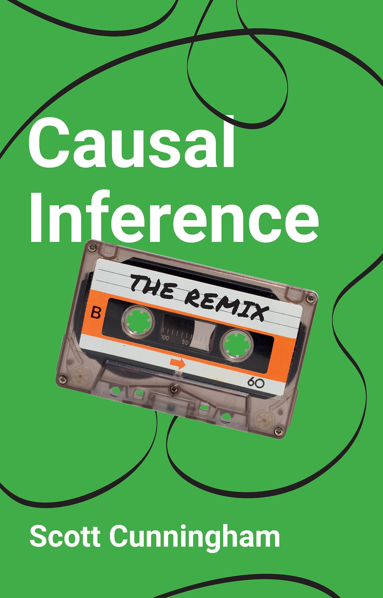

# The Remix Workshops

<p align="center">
  
</p>

> **Companion materials for Scott Cunningham's Summer 2026 European teaching tour.**
> Decks, labs, shiny apps, and readings for each stop. Tailored to host institutions but built from a shared spine of *Causal Inference: The Remix* content.

---

## About the book

*Causal Inference: The Remix* (Yale University Press, **forthcoming summer 2026**) is the third edition of *Causal Inference: The Mixtape*. The Remix significantly expands the panel-data sections — modern difference-in-differences (Goodman-Bacon decomposition; Callaway-Sant'Anna; Sun-Abraham; de Chaisemartin-D'Haultfoeuille; Borusyak-Jaravel-Spiess imputation), augmented synthetic control, matrix completion, and synthetic difference-in-differences. The 2026 edition will be available in print from Yale University Press, **and a free version will be released alongside it on GitHub** (link will be posted here once live).

The materials in this repo are the workshop spine for the book — derived from the same examples and code as the published edition, organized for in-person teaching.

---

## The 2026 European tour — 7 stops

| Stop | City | Dates | Host | Format |
|---|---|---|---|---|
| 1 | [**Zurich**](zurich/) | May 11–13, 2026 | University of Zurich (UZH Econ) | 3-day PhD mini-course in Causal Inference |
| 2 | [**Glasgow**](glasgow/) | May 18–22, 2026 | Adam Smith Business School, Univ. of Glasgow | 5-day Statistical Inference course |
| 3 | [**Ispra**](ispra/) | June 3–4, 2026 | European Commission, JRC Ispra | 2-day, 16-hour panel-data course |
| 4 | [**Pisa**](pisa/) | June 8–10, 2026 | Sant'Anna School (Seasonal School CME) | 17-hour course in Causal Inference with Micro Data |
| 5 | [**Lucca**](lucca/) | June 18–20, 2026 | IMT School for Advanced Studies | Seminar + PhD student meetings |
| 6 | [**Berlin**](berlin/) | June 15–16, 2026 | DIW Berlin (organized by Univ. of Potsdam) | 2-day Masterclass: 3 lectures + research talk |
| 7 | [**Leuven**](leuven/) | June 24, 2026 | KU Leuven, LEER | 1-day course on recent DiD developments |

*Madrid CodeChella (May 25–28) is also part of the tour but uses Mixtape Sessions materials and is not included in this repo.*

---

## Repo structure

```
the-remix-tour/
├── README.md                  this file
├── LICENSE                    MIT
├── readings/                  catalog of papers (DOI / arXiv / open-access links)
│   └── README.md
├── images/                    branding assets
│   └── green_remix_cover.png
└── <city>/                    one folder per stop
    ├── README.md              stop description, schedule, what's taught
    ├── labs/                  R / Stata code labs (per-stop selection)
    ├── decks/                 compiled slide PDFs (per-stop selection)
    └── shiny_apps/            interactive demos
```

Each stop's folder is **self-contained** for that audience — open it, find the README, follow the lab/deck/shiny links. The selections vary by stop because the audiences and time budgets differ:

- **Zurich** (3 full days): foundations + DiD + synth, 18 lessons, hands-on R + Stata
- **Glasgow** (5 days): the most complete arc — adds continuous DiD, augmented SCM, sensitivity
- **Ispra** (2 days, 16 hrs): condensed panel-data course for JRC scientists; emphasis on practical application
- **Pisa** (3 days, 17 hrs): Sant'Anna Seasonal School; **uses Claude Code as a teaching tool** for live coding
- **Lucca**: research seminar + PhD one-on-one meetings (different format from the courses)
- **Berlin** (2 days): 3 lectures (DiD foundations + modern DiD + synthetic control) + a research talk
- **Leuven** (1 day): focused on **recent developments in the DiD literature** for the LEER group

---

## How to use these materials

Each stop's folder is the right entry point if you're attending or teaching that stop. The decks compile from `Causal-Inference-2` (Scott's standing workshop repo) — copies of the relevant compiled PDFs are included here for convenience. Lab folders include R / Stata code; you'll need:
- **R** with `tidyverse`, `fixest`, `did`, `synthdid`, `bacondecomp`, `eventStudy` (and friends).
- **Stata** with `csdid`, `did_imputation`, `synth`, `synth_runner` (and friends).
- For the **Pisa** stop, **Claude Code** is used as a live-coding environment.

Readings are cataloged in [`readings/README.md`](readings/) with links — no PDFs are duplicated here.

---

## Themes and design

This repo follows the visual themes of *The Remix* — the green cover and the riverboat / Mississippi-river framing of causal inference. The book is structured in four parts:

- **Part I — Foundational Ideas:** potential outcomes, randomization, DAGs
- **Part II — Cross-Sectional Designs:** unconfoundedness, RDD, IV
- **Part III — Panel Designs:** fixed effects, DiD fundamentals, complex DiD, synthetic control
- **Part IV — Conclusion**

The workshops emphasize Part III (the panel methods) since that's where the field has moved fastest and where Scott's recent contributions sit.

---

## License

MIT — see [`LICENSE`](LICENSE). Slide PDFs and code are Scott's; readings are linked rather than republished. Reuse encouraged, attribution appreciated.

---

## Contact + acknowledgments

Scott Cunningham · Ben H. Williams Professor of Economics, Baylor University · scott_cunningham@baylor.edu · [scunning.com](https://www.scunning.com) · [Mixtape Sessions](https://www.mixtapesessions.io)

Acknowledgments to the seven host institutions and to the dozens of students and colleagues whose feedback has shaped these materials over years of teaching. Particular thanks to the co-organizers, hosts, and assistants who made this tour possible.

